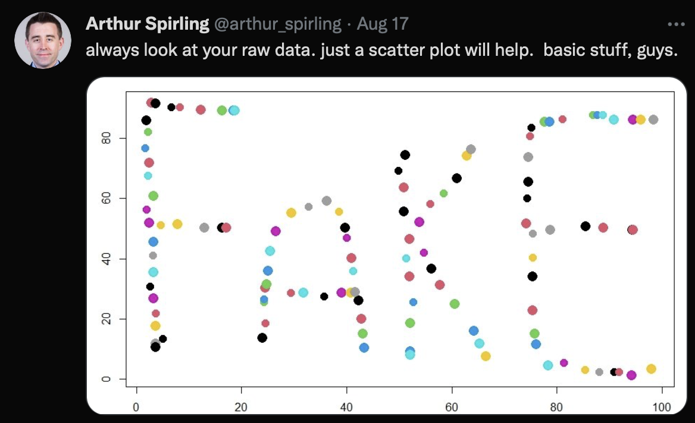

# Today's Agenda: Learning Objectives

Summarizing Univariate (Single) Relationship using Bargraphs and histograms in the glorious world of `ggplot`

- `geom_bar`, `geom_histogram`, `geom_density`

- `labs`, `scale_x_continuous`, `scale_y_continuous`

# Motivation: Communicating Data is Essential

- Data does not exist in a vacuum -- it is always interpreted in relationship to something.

- All data-science should be question driven!  What is the question you are asking?

- What is the answer that your visualization is providing?

- Does your visualization communicate the relationship cleanly and accurately?

- Humans infer causality (much too quickly!).

# Visualization using ``ggplot`

- Everything in an R visualization can be controlled.

- Graphs themselves are an object that can be saved and altered.

- Start with a blank "canvass" and then you add the visuals.

- Actually, you start with the question you want the visualization to answer.

# Visualization First Steps

First graph is usually a summary of the data: what does it look like?

- Central tendency? (Where is most data located?)

- Variation? (Range? Dispersion? Skew?)

# Application: 2020 Election

{scale=25%}

# Loading Polling Data

```{r, message=FALSE}
library(tidyverse)
Pres2020.PV <- readRDS(file="Pres2020.PV.Rds")
glimpse(Pres2020.PV)
```

#   What is our question?

How did polls of the National Popular Vote for the 2020 presidential election vary?

- Support for Biden and Trump?  Difference in support between Biden and Trump?

#   Start by defining some variables we need


```{r}
Pres2020.PV <- Pres2020.PV %>%
  mutate(margin = Biden - Trump)
```

```{r}
Pres2020.PV %>%
          select(margin) %>%
          summary()
```

Visualization can find things hidden by numeric summaries.

{scale=25%}

# The plot we use depends on the type of data we have!

We only have 1 variable (x-axis), but 2 options depending on whether categorical/discrete or continuous!

- `geom_barplot` - discrete/ordinal variables (i.e., values take on a finite number of values)

- `geom_histogram` - continuous (i.e., values take on a continuous number of values)

To add an element to our `ggplot` we need to "add" it.  Unless we say otherwise, the arguments of each additional element will be defined using the aesthetics we define in the ``ggplot` function. (You will see what this means when we get to plotting multiple variables and relationships.)

We are going to "pipe" the function `ggplot` through the tibble we want to analyze.  To use the `ggplot` function we need to define an `aes`thetic that can consist of several arguments.  To start, let's define the variable we want to plot along the horizontal (x) axis by setting `x= margin` in the aesthetic.

```{r}
Pres2020.PV %>% 
    ggplot(aes(x = margin)) 
```

Well that did not do very much.  All that we have done is to define a blank canvass!  We can see that the horizonal axes is named `margin` -- the variable we defined as the `x` variable in the aesthetic -- and also that the scale of the x-axis corresponds to the range of values associated with `margin` we uncovered when we used the `summary` command above.  The sparseness of what we have here illustrates that  nearly **everything** in `ggplot` is customizable.  We can control exactly what we want to plot and where.


To graph the distribution of margin using purple-colored bars with black outlines we we call the following:
```{r}
Pres2020.PV %>% 
  ggplot(aes(x = margin)) + 
  geom_bar(fill = "purple", color = "black")  
```

where: 
- `fill` is the color of the bars
- `color` is the border of the bars

*Quick Exercise*  What happens if we use `y=` instead of `x=`?

```{r}
# INSERT CODE HERE
```

Having added the data we now want to make it more understandable by labelling the graph.  **Never use variable names as labels** Your goal is to make the graph understandable to someone who is not familiar with your data set.

We are going to add the `labs` (labels) element and use it to define three labels -- the x-axis (`x`), the y-axis (`y`), and a title for the graph (`title`).  Pulling this together, the required syntax is as follows (notice how each label is separated by a comma and the titles are in quotations).

```{r}
Pres2020.PV %>% 
  ggplot(aes(x = margin)) + 
  geom_bar(fill = "purple", color = "black")  + 
  labs(title = "Distribution of Margin in 2020 National Popular Vote Polls",
       x = "Margin: Biden - Trump",
       y = "Number of Polls")
```

Note how long our title is!  We can split it into two lines by telling R where to break the line using `\n`.  We may also want to change the title to use less characters.

```{r}
Pres2020.PV %>% 
  ggplot(aes(x = margin)) + 
  geom_bar(fill = "purple", color = "black")  + 
  labs(title = "Distribution of 2020 Margin: \n National Popular Vote Polls",
       x = "Margin: Biden - Trump",
       y = "Number of Polls")
```

Because R is an object-oriented language, we can actually save our graph as an object and then add to that object. For example, if we wanted to add a vertical line to highlight the location of `0` -- the location of a tied-race -- we can save the `ggplot` object and then add to it as follows.

The following code produces a `ggplot` object named `popvotemargin`...
```{r}
popvotemargin <- Pres2020.PV %>% 
  ggplot(aes(x = margin)) + 
  geom_bar(fill = "purple", color = "black")  + 
  labs(title = "Distribution of Margin in 2020 National Popular Vote Polls",
       x = "Margin: Biden - Trump",
       y = "Number of Polls")
```

Note that when we run this code chunk that we have now created a new list object in the Global Environment.

And the following snippet adds a vertical line located at x=0 of width 2 (`lwd` = line width):

# Adding a (linear) line to the plot
```{r}
popvotemargin + geom_vline(xintercept = 0, lwd=2)
```

Highlighting the possible additions we can use, we can add linear lines, horizontal lines and vertical lines using the following syntax.

- `+ geom_abline(intercept = A , slope = B)`: add a line with y-intercept A and slope B

- `+ geom_vline(xintercept = A)`: add a vertical line with x-intercept A

- `+ geom_hline(yintercept = A)`: add a horizontal line with y-intercept A

To save the graph as a separate file we use the `pdf` function to define the location where the ggplot object is to be saved.  

```{r eval = FALSE}
# Note that I have set eval=FALSE for this chunk.  
# If you want to create the PDF, delete that code.
pdf(file="2020MarginBarplot.pdf")
popvotemargin + geom_vline(xintercept = 0, lwd=2)
dev.off()
```

The default in ggplot is to have a grey background.  This can be distracting.  We can suppress this by telling ggplot to use a black and white theme by adding `theme_bw` to the plot object as follows.

```{r}
popvotemargin + 
  geom_vline(xintercept = 0, lwd=2) + 
  theme_bw()
```

The other thing to note is that the default scale is rather lumpy. We can specify the values that we want R to use using the function `scale_x_continous` to label the points at -5,0,5,10 and 15 by defining a sequence (`seq`) that ranges from `-5` to `15` in increments (`by =`) of 5.  (This is a little confusing because we are using `scale_x_continuous` to plot the distribution of a discete random variable.)

```{r}
popvotemargin + 
  geom_vline(xintercept = 0, lwd=2) + 
  theme_bw() +
  scale_x_continuous(breaks=seq(-5,15,by=5))
```

The other thing to note is that our x-axis is actually a percentage. More on this later. Note that we are adding to the graph so we are not changing things that are already defined.

If we want to be a bad data scientist and change the limits of our graph we can change the limits being plotted as well.

```{r}
popvotemargin + 
  geom_vline(xintercept = 0, lwd=2) + 
  theme_bw() +
  scale_x_continuous(limits=c(-100,100),breaks=seq(-100,100,by=10))
```

*Quick Exercise*  Change the y-axes to range from 0 to 200 as well.  Change the increments that are being reported to be in increments of 50.

```{r}
# INSERT CODE HERE
```

# Histogram

For continuous variables we use a histogram.  Rather than plot the number of observations associated with each value of the variable we plot the number of observations that fall into a range along the x-axis.  To do so we divide the range up into equally-sized "bins" and plot how many observations falls into each bin.  Note that the bins will be defined to span the range of the x-variable in a uniform manner (i.e., they will be equally wide).  The default of `geom_histogram` is to choose 30 bins -- which it promptly warns you against using! -- so let us choose a sensible number that allows us to capture the variation in our data. (This is somewhat more art than science.) To outline each bar we have included the parameter `color=black` as an argument of `geom_histogram`.

```{r}
Pres2020.PV %>%
  ggplot(aes(x = margin)) + 
  labs(title = "Margin in 2020 National Popular Vote Polls",
       x = "Margin: Biden - Trump",
       y = "Number of Polls") + 
    geom_histogram(bins=10, color= "black") +
    scale_x_continuous(breaks=seq(-5,15,by=5))
```

*Quick Exercise*  Change the number of bins being plotted to 5 and change the color of the bins to some other color.  Now change the number of bins to 40.  What do you observe about each?

```{r}
# INSERT CODE HERE
```

The default histogram plot plots how many observations fall into each bin.  But it can sometimes be hard to interpret what that means if we were to compare across different datasets where the number of observations (and therefore the scale of the y-axis) varies.  One way to get around this is to plot what is known as the "density" of the data by including `aes(y = ..density..)` as an argument to `geom_histogram`.

```{r}
Pres2020.PV %>%
  ggplot(aes(x = margin)) + 
  labs(title = "Margin in 2020 National Popular Vote Polls",
       x = "Margin: Biden - Trump",
       y = "Density") + 
  geom_histogram(bins = 10, aes(y = ..density..), color = "black") +
    scale_x_continuous(breaks=seq(-5,15,by=5))
```

Notice how the y-axis has changed to be a value that is between 0 and 1.  This is **not** a proportion, but it is instead the area under a curve such that if we add up the area contained in each of the bars (width x height) they would sum to 1.  Put differently, if the bins are of width 5 (e.g., a margin of -2.5 to 2.5) and the height of the bar is 0.01 then the proportion of polls that have a margin between -2.5 and 2.5 is 5 x .01 = 5\%.

We often use densities when comparing the distribution of different variables because they always sum/integrate to 1.

*Quick Exercise*  Can you change the y-axis to range from 0 to 15 in increments of 0.025?

```{r}
# INSERT CODE HERE
```


For continuous variables we can dispatch with the need to choose a `bin` when using `geom_histogram` to plot the distribution of the data itself using `geom_density`.  The upside is that our characterization is no longer dependent on our choice of `bin`, but the "cost" is that the interpretation is not as straightforward as the number of observations that fall within each bin size.

```{r}
Pres2020.PV %>%
  ggplot(aes(x = margin)) + 
  labs(title = "Density of the Margin in 2020 National Popular Vote Polls",
       x = "Margin: Biden - Trump",
       y = "Density") + 
  geom_density(color = "black") +
    scale_x_continuous(breaks=seq(-5,15,by=5))
```

This shows the distribution of continuous variables without having to choose a bin size, but recall that the interpretation is a bit tricky -- the probability of a poll occurring in a particular range is the "area under the curve".

# Plotting Single Variables

- If discrete: `geom_bargraph`

- If continuous: `geom_histogram`

- If want to compare variation across variables (on same ggplot) - density.

- Always label! 

*Quick Exercise* Plot the distribution of either Trump or Biden.  What kind of graph do you need?

```{r}
# INSERT CODE HERE
```

*Quick Exercise*  We also have the actual election result.  Can you plot the distribution of candidate polling error? (i.e., how far off the support for Biden in the polls (`Biden`) was from the certified vote he received (`DemCertVote`)?  HINT: `mutate` before you `ggplot`.

```{r}
# INSERT CODE HERE
```


# Advanced -- Multiple (Similar) Variables on Same Axes

Using `ggplot` we can also include two distributions on the same plot.  Note that we must be careful to make sure that it makes sense to do so.  To do so we use the fact that we can add multiple `geom_bar` objects to a plot and have each one be associated with a different variable.  So in the code snippet that follows we are plotting the distribution of Biden support contained in the `Biden` variable in the `Pres2020.PV` tibble in one `geom_bar` (and using `fill` to make it blue) and plotting the `Trump` vote share in a separate `geom_bar` that is colored red.

To begin we are going to assume we have two different variables - one associated with each group being plotted.  Next week we will show how we can do something similar using single variable by conditioning on another variable. 

```{r}
Pres2020.PV %>%
  ggplot() + 
  labs(title = "Support for Trump and Biden in 2020 National Popular Vote Polls",
       x = "Margin: Biden - Trump",
       y = "Number of Polls") + 
  geom_bar(aes(x = Biden), fill = "blue") + 
  geom_bar(aes(x = Trump), fill = "red") +
  scale_x_continuous(breaks=seq(30,70,by=5))
```

This shows you how the distribution of Trump support compares to the distribution of Biden support.  However, one thing to note is that the sequence matters because the bars are not transparent which means that later additions will cover up prior information.  As a result, it is unclear whether the lack of any blue bars less than 45 is because there are no polls showing Biden with less than or equal to 45\% support or their are fewer such polls than Trump polls.  To examine this in more detail, compare the results to what we just did to what happens if we plot `Trump` before `Biden`.

To better plot the two distributions in ways that allow us to see the full distribution of both variables we want to adjust the "alpha transparency" of the color fills. To do so we chose a value for `alpha` between 0 (completely transparent -- no color) and 1 (completely solid -- all color).  Choosing a value of `.5` seems to provide a decent balance that allow us to see that there are indeed some polls that showing Biden with low levels of popular vote support -- just as there are some polls showing a high level of Trump support.  Note that we included the `\n` in the title to force a line break in the title.

```{r}
Pres2020.PV %>%
  ggplot() + 
  labs(title = "Support for Trump (Red) and Biden (Blue) \n 
       in 2020 National Popular Vote Polls",
       x = "Percentage Supporting Candidate",
       y = "Number of Polls") + 
  geom_bar(aes(x = Biden), fill = "blue", alpha = .5) + 
  geom_bar(aes(x = Trump), fill = "red", alpha = .5) +
  scale_x_continuous(breaks=seq(30,70,by=5))
```

We could also use `geom_density` to plot the densities of the two variables on the same graph.

```{r}
Pres2020.PV %>%
  ggplot() + 
  labs(title = "Distribution of Support for Trump (Red) and Biden (Blue) \n 
       in 2020 National Popular Vote Polls",
       x = "Percentage Supporting Candidate",
       y = "Density") + 
  geom_density(aes(x = Biden), color = "blue", lwd=2) + 
  geom_density(aes(x = Trump), color = "red", lwd=2) +
  scale_x_continuous(breaks=seq(30,70,by=5))
```

We can clean things up a bit by treating `Biden` and `Trump` as percentages that vary between 0\% and 100\%. To do so we are going to plot `Biden/100` and `Trump/100` and change the x-axis scale to range from .3 to .7 and then also let R know that the values being plotted are percentages using the `labels = scales::percent` command.  So doing will plot the x-axis with a percentage sign and help readers better interpret the numbers being plotted.  To do this we are going to use `mutate` to create the variable we are going to plot.  Note that this can be helpful if we want to change the scale of a variable in our dataset (e.g., to create a proportion, or a per-capita measure, etc.)

```{r message=FALSE}
library(scales)

Pres2020.PV %>%
  mutate(Bidenpct = Biden/100,
         Trumppct = Trump/100) %>%
  ggplot() + 
  labs(title = "Distribution of Support for Trump (Red) and Biden (Blue) \n 
       in 2020 National Popular Vote Polls",
       x = "Percentage Supporting Candidate",
       y = "Density") + 
  geom_density(aes(x = Bidenpct), color = "blue", lwd=2) + 
  geom_density(aes(x = Trumppct), color = "red", lwd=2) +
  scale_x_continuous(breaks=seq(.3,.7,by=.05),
                     labels= scales::percent)
```

To get rid of the trailing decimal point, we can tell R that we only have a single digit of scientific precision by noting that `accuracy = 1` as follows. Note that we have to change `labels= scales::percent` to `labels= scales::percent_format(accuracy =1)`.

```{r}
Pres2020.PV %>%
    mutate(Bidenpct = Biden/100,
          Trumppct = Trump/100) %>%
  ggplot() + 
  labs(title = "Distribution of Support for Trump (Red) and Biden (Blue) \n 
       in 2020 National Popular Vote Polls",
       x = "Percentage Supporting Candidate",
       y = "Density") + 
  geom_density(aes(x = Bidenpct), color = "blue", lwd=2) + 
  geom_density(aes(x = Trumppct), color = "red", lwd=2) +
  scale_x_continuous(breaks=seq(.3,.7,by=.05),
                     labels= scales::percent_format(accuracy = 1))
```

That said, note how the y-axis has changed as a result!  Because probability must sum to 1, when we divide the x-variable by 100 the result is that the y-variable (density) must be changed accordingly.  This again highlights that the value of the density graph is not so much the precise values of the y-axis as it is the comparison of how the distribution of variables compare to one another.

Note that this is a little weird because each poll contains a value for both `Biden` and `Trump` but the graph we just produced does not really convey that relationship.  Now because most respondents chose either Biden or Trump (but not all -- if we add `Biden` and `Trump` we do not get 100) a high value of `Biden` is associated with a low value of `Trump` this can be harder to interpret if there are multiple variables. Note also that your brain automatically wants to draw an inference about the relative comparison between `Biden` and `Trump` given how it is plotted.
